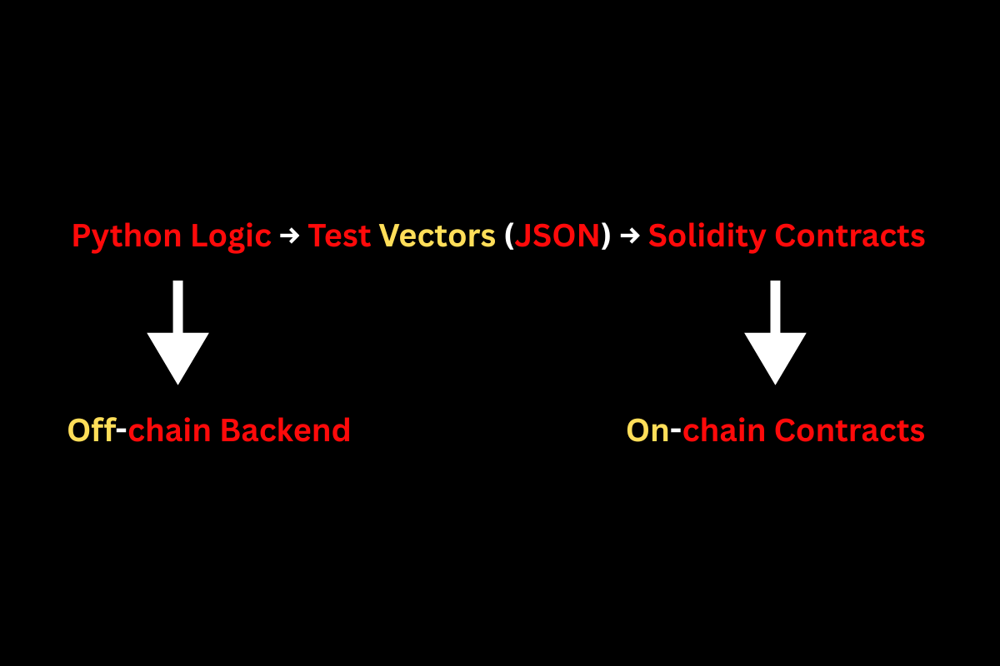
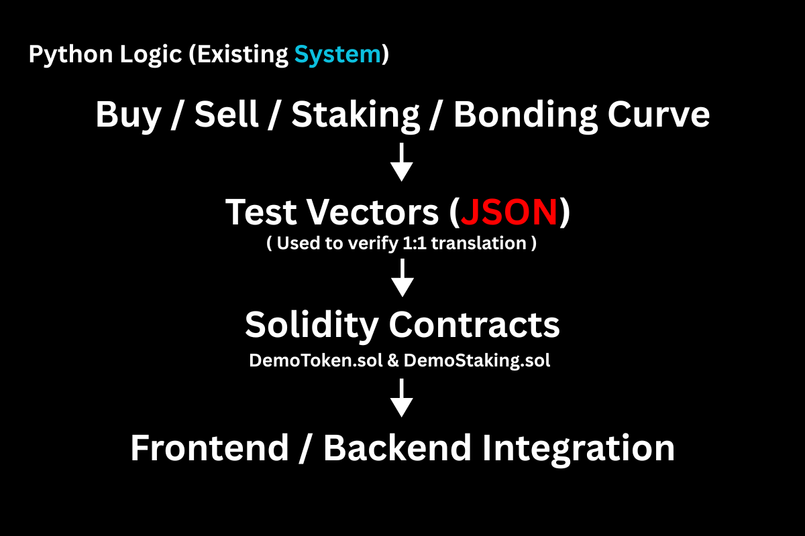

# consultant-technical-lead

This repository demonstrates my skills as a **Blockchain Devoloper / Consultant / Technical Lead** for a Python → Solidity migration project. It includes secure ERC20 token and staking contracts, Python validation, test vectors, and migration flowcharts.

---

## 📝 Contents

- **contracts/**  
  - `DemoToken.sol` – ERC20 token with transfer fee  
  - `DemoStaking.sol` – Staking contract with reward calculation  

- **test_vectors.json** – JSON file with sample inputs/outputs for validation  

- **validate_rewards.py** – Python script to verify Solidity calculations match Python logic  

- **flowchart.png** – Python → Solidity → Validation Flow  

- **migration_flow.png** – On-chain vs Off-chain Logic Flow  

- **README.md** – This file  

---

## 📊 Flowcharts

### 1. Validation Flow
  
*Figure 1: Python → Solidity → Validation Flow*

### 2. On-chain vs Off-chain Logic
  
*Figure 2: On-chain vs Off-chain Logic*

---

## 🛠 Python → Solidity Validation

We use test vectors to ensure 1:1 accuracy between your existing Python logic and Solidity contracts.

**Run validation:**

```bash
python validate_rewards.py
